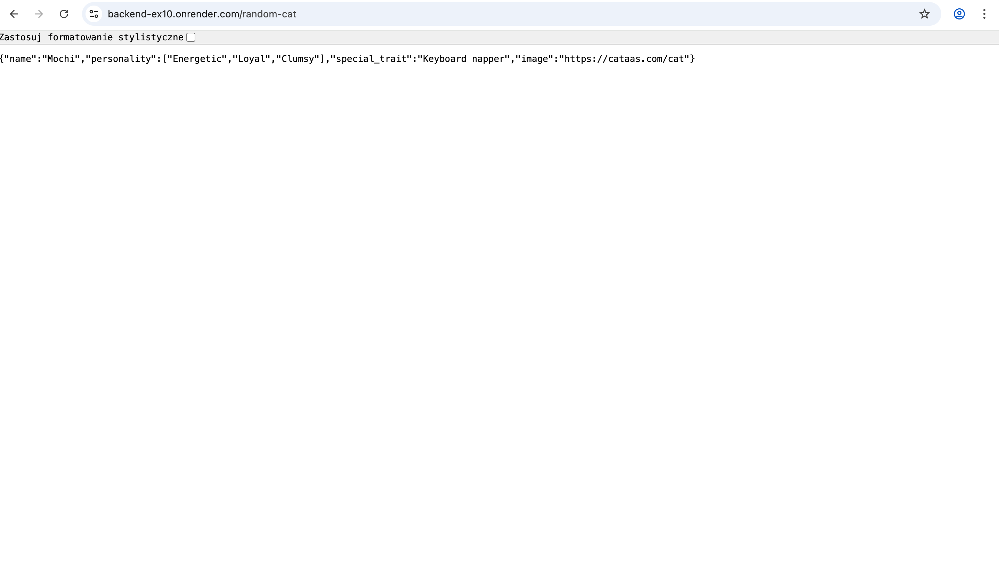
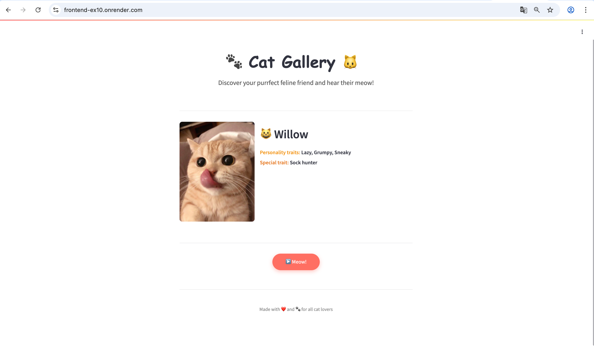

✅ 3.0 Należy stworzyć odpowiednie instancje po stronie chmury na
dockerze - [Link](https://github.com/olast45/E-biznes/commit/1de1c0691cbb1f31a0385cbd2456e6f3642cc957)

3.5 Stworzyć odpowiedni pipeline w Github Actions do budowania
aplikacji (np. via fatjar)

4.0 Dodać notyfikację mailową o zbudowaniu aplikacji

4.5 Dodać krok z deploymentem aplikacji serwerowej oraz klienckiej na
chmurę

5.0 Dodać uruchomienie regresyjnych testów automatycznych
(funkcjonalnych) jako krok w Actions

## Demo

## Deployed Backend

## Deployed Frontend

