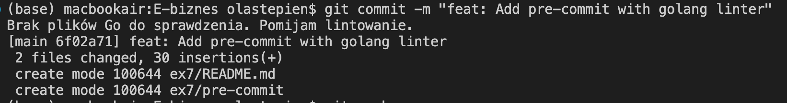

### [Statyczny Skan](https://sonarcloud.io/summary/overall?id=olast45_E-biznes)

### Linter

✅ 3.0 Należy dodać litera do odpowiedniego kodu aplikacji serwerowej w
hookach gita - [Link](https://github.com/olast45/E-biznes/commit/6f02a71cd7df64b2973d380e6a607de1f78c4256)

3.5 Należy wyeliminować wszystkie bugi w kodzie w Sonarze (kod
aplikacji serwerowej)

4.0 Należy wyeliminować wszystkie zapaszki w kodzie w Sonarze (kod
aplikacji serwerowej)

4.5 Należy wyeliminować wszystkie podatności oraz błędy bezpieczeństwa
w kodzie w Sonarze (kod aplikacji serwerowej)

5.0 Należy wyeliminować wszystkie błędy oraz zapaszki w kodzie
aplikacji klienckiej
