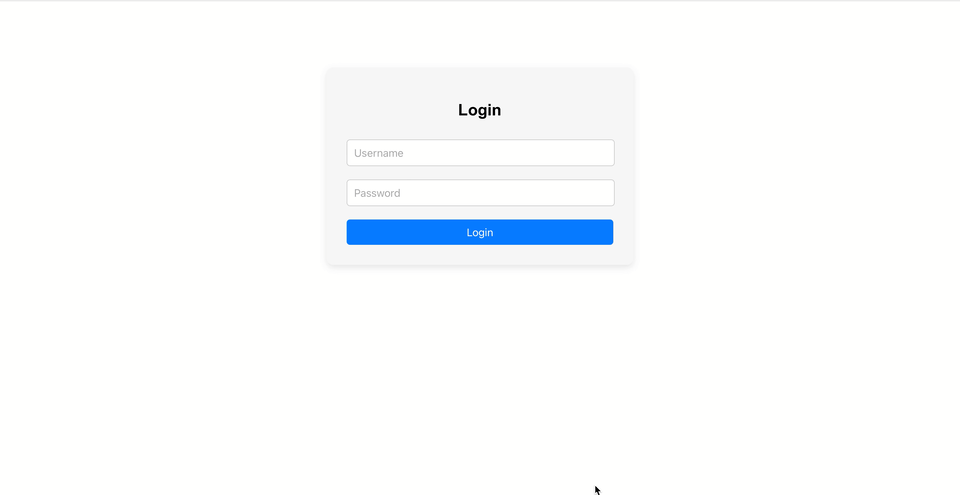

✅ 3.0 logowanie przez aplikację serwerową (bez Oauth2)

3.5 rejestracja przez aplikację serwerową (bez Oauth2)

4.0 logowanie via Google OAuth2

4.5 logowanie via Facebook lub Github OAuth2

5.0 zapisywanie danych logowania OAuth2 po stronie serwera

## Demo

